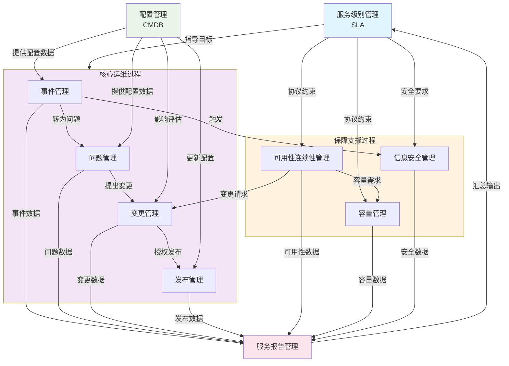

## **甘肃国邦运维服务过程框架设计图**

---

## **框架设计说明**

### **一、整体架构**
框架遵循**三层架构、双向协同**原则：
1. **指导层**：服务级别管理（SLA）作为顶层目标导向
2. **执行层**：四大核心运维过程形成闭环工作流
3. **支撑层**：三大保障过程确保系统稳定、安全、高效
4. **数据层**：配置管理（CMDB）作为统一数据底座
5. **报告层**：服务报告管理作为结果汇总与反馈通道

### **二、核心逻辑流**
1. **事件→问题→变更→发布** 形成运维主流程闭环
2. **配置管理（CMDB）** 为所有过程提供一致的配置数据
3. **保障过程** 为执行层提供容量、可用性、安全支持
4. **服务报告** 汇总各过程数据，反馈至SLA管理，形成PDCA循环

### **三、关键协作关系**

| 协作关系              | 说明                                                     |
| --------------------- | -------------------------------------------------------- |
| **SLA→各过程**        | 服务级别协议是所有过程的共同目标和约束条件               |
| **配置管理→各过程**   | CMDB为事件定位、问题分析、变更评估、发布执行提供数据支持 |
| **事件→问题→变更**    | 重大/重复事件转为问题，问题分析后提出变更请求            |
| **变更→发布**         | 所有变更需经授权后由发布管理统一执行                     |
| **保障过程→执行过程** | 可用性、容量、安全需求触发相应变更和优化                 |

### **四、绩效指标关联**
根据《需求分析报告》，各过程的关键绩效指标（KPI）均围绕SLA达成展开：
- 事件管理：解决率≥95%，按时解决率≥95%
- 问题管理：解决率≥85%
- 变更管理：成功率≥98%
- 发布管理：成功率≥98%
- 可用性管理：可用性≥99%，中断≤2次/季度
- 容量管理：容量事件≤2次/季度
- 安全管理：安全事件≤1次/年

---

## **实施建议**

1. **分阶段落地**：
   - 第一阶段：建立事件、变更、配置管理基础
   - 第二阶段：完善问题、发布、报告管理流程
   - 第三阶段：整合可用性、容量、安全管理

2. **工具支撑**：
   - 建议采用一体化ITSM平台，实现各过程数据自动流转
   - 配置管理建议建立CMDB，确保数据准确率≥95%

3. **组织适配**：
   - 明确各过程角色与职责（参考需求分析报告）
   - 建立跨部门协作机制，特别是质量部与运维部的协作

4. **持续改进**：
   - 每季度评审框架运行效果
   - 基于服务报告数据优化SLA和过程指标

---

如果需要将此图导出为高清晰图片、PPT可编辑格式，或者需要为某个具体过程制作详细子流程图，我也可以为您生成相应的可视化文件。